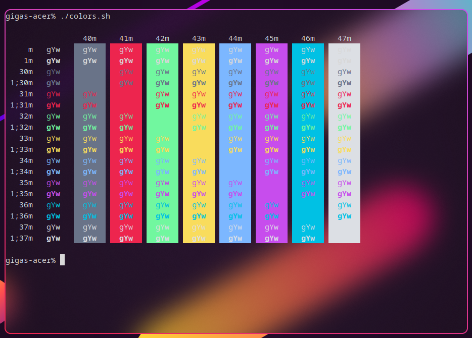

# Sweet-Alacritty

Sweet theme for [alacritty](https://github.com/alacritty/alacritty) terminal emulator

## Requriments

There's none, it's a color scheme

## Installation

Copy theme file to your desired location, e.g. `~/.config/alacritty/themes/Sweet.toml`

Then, import your theme in config file, e.g. `~/.config/alacritty/alacritty.toml`, adding the line: `import = ["~/.config/alacritty/themes/Sweet.toml"]`

## Showcase

