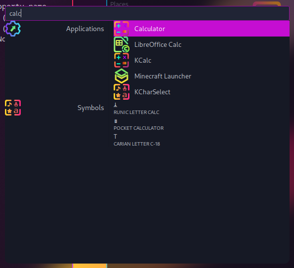

# Sweet-Anyrun

Instruction on how to use `Sweet` theme with [anyrun](https://github.com/anyrun-org/anyrun)

## Requriments

- Sweet GTK theme ([aur](https://aur.archlinux.org/packages/plasma5-themes-sweet-full-git))
- Sweet folder icons ([aur](https://aur.archlinux.org/packages/sweet-folders-icons-git))

## Installation

`anyrun` uses your GTK theme by default, so additional tweaking to add `Sweet`ish look to it is not needed, but you can always additionally configure your `~/.config/anyrun/config.ron` and `~/.config/anyrun/style.css` for a better looks

## Showcase

