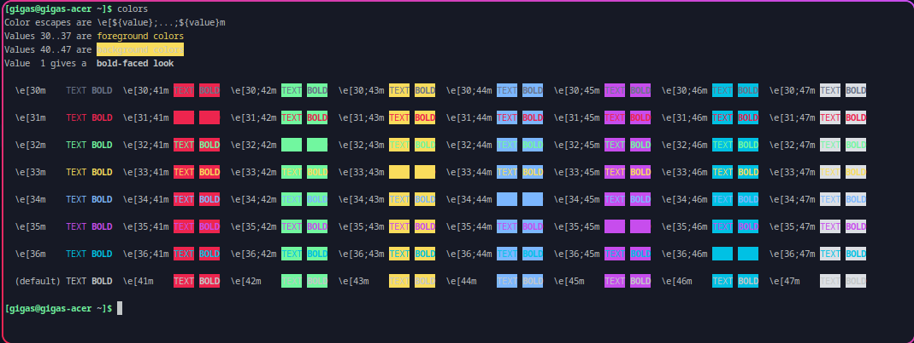

# Sweet-Foot

Sweet theme for [foot](https://codeberg.org/dnkl/foot)

## Requriments

There's none, it's a color scheme

## Installation

Copy theme file into your desired location, e.g. `~/.config/foot/themes/Sweet`

Then, reference theme in `~/.config/foot/foot.ini`:

```ini
[main]
include=~/.config/foot/themes/Sweet
```

## Showcase


