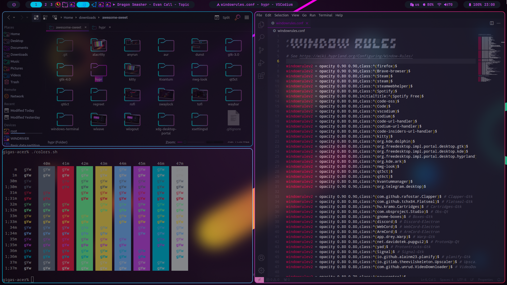

# Sweet-Hyprland

Sweet theme for [hyprland](https://github.com/hyprwm/Hyprland)

This theme introduces border coloring, and minor style effects for a `hyprland`. It also forces compositor to use `Sweet` GTK, cursors and icons theme

If you want a more unified look of your qt applications, you should also use `qt5ct`, `qt6ct` and `kvantum` with combination of [Sweet Kvantum](https://github.com/EliverLara/Sweet/tree/nova/kde/Kvantum/Sweet) theme

## Requriments

- Sweet GTK theme ([aur](https://aur.archlinux.org/packages/plasma5-themes-sweet-full-git))
- Sweet cursors theme ([aur](https://aur.archlinux.org/packages/plasma5-themes-sweet-full-git))
- Sweet folder icons ([aur](https://aur.archlinux.org/packages/sweet-folders-icons-git))

**Optional**

- Candy icons ([aur](https://aur.archlinux.org/packages/candy-icons-git))
- Beautyline icons ([aur](https://aur.archlinux.org/packages/beautyline))
- Sweet kvantum theme ([aur](https://aur.archlinux.org/packages/plasma5-themes-sweet-full-git))

## Installation

Copy theme file to your hyprland configs directory, e.g. `~/.config/hypr/themes/Sweet.conf`

Then, `source` your theme file in a `hyprland.conf` file, e.g. `source = ~/.config/hypr/themes/Sweet.conf`

## Showcase

Note: this example depends on a lot of software, plus `hypr` configs are pretty big, so you can browse these in a [separate repo](https://github.com/Gigas002/software-and-services/tree/master/dotfiles)
