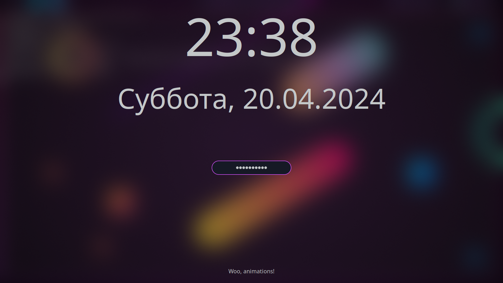

# Sweet-Hyprlock

*WIP: I'm not sure how can the colors be separated from hyprlock config, when I'll figure this out I'll update this example*

Sweet theme for [hyprlock](https://github.com/hyprwm/hyprlock/)

## Requriments

- Hyprland ([arch](https://archlinux.org/packages/extra/x86_64/hyprland/))

## Installation

*WIP: I'm not sure how can the colors be separated from hyprlock config, when I'll figure this out I'll update this example*

## Showcase

