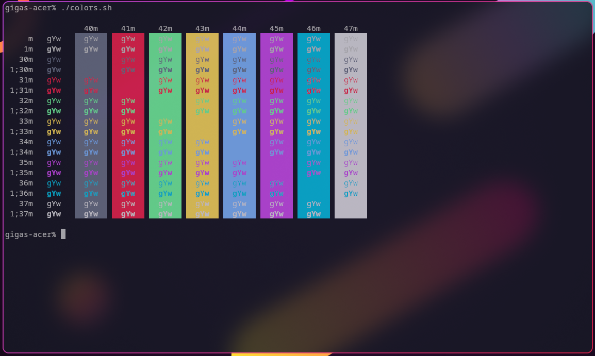

# Sweet-Kitty

Sweet theme for [kitty](https://github.com/kovidgoyal/kitty) terminal emulator

## Requriments

There's none, it's a color scheme

## Installation

Copy theme file to your kitty config location, e.g. `~/.config/kitty/themes/Sweet.conf`

Then, import your theme in config file, e.g. `~/.config/kitty/kitty.conf`, adding the line: `include Sweet.conf`

## Showcase

