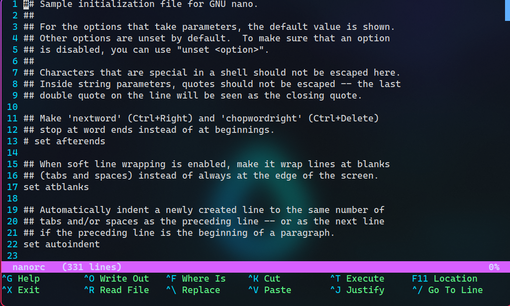

# Sweet-Nano

Sweet theme for [nano](https://git.savannah.gnu.org/cgit/nano.git)

## Requriments

There's none, it's a color scheme

## Installation

AFAIK, it's not possible to override nano's UI colors from include file, so these changes must be made directly into your `nanorc` file

You can either copy whole theme file and use it as your `nanorc` file, or copy `Sweet.nanorc` contents into your `nanorc` file

The `nanorc` configuration file can be placed into `~/.nanorc` or `~/.config/nano/nanorc`

## Showcase

