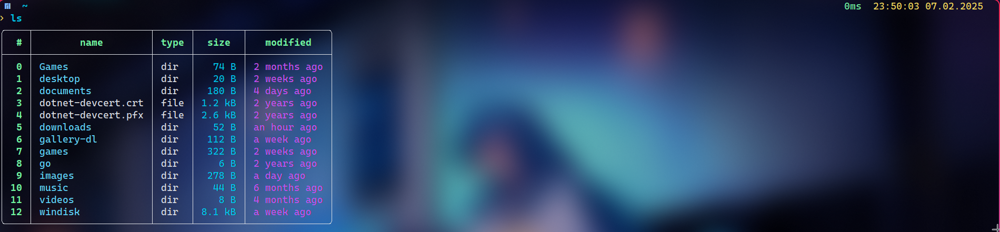

# Sweet-Oh-My-Posh

Instruction on how to use `Sweet` theme with [oh-my-posh](https://github.com/JanDeDobbeleer/oh-my-posh)

## Installation

Copy the `Sweet.omp.json` file into `~/.config/oh-my-posh/themes`. Then, run commands according to your shell, see omp [guide](https://ohmyposh.dev/docs/installation/customize)

## Showcase

