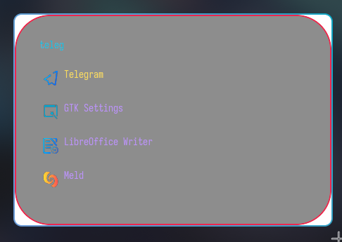

# Sweet-Onagre

Instruction on how to use `Sweet` theme with [onagre](https://github.com/onagre-launcher/onagre)

The white background is an upstream bug for now, deal with it

## Requriments

Sweet-Rainbow icons

## Installation

Copy the `Sweet.scss` file into `~/.config/onagre/theme.scss`

## Showcase

