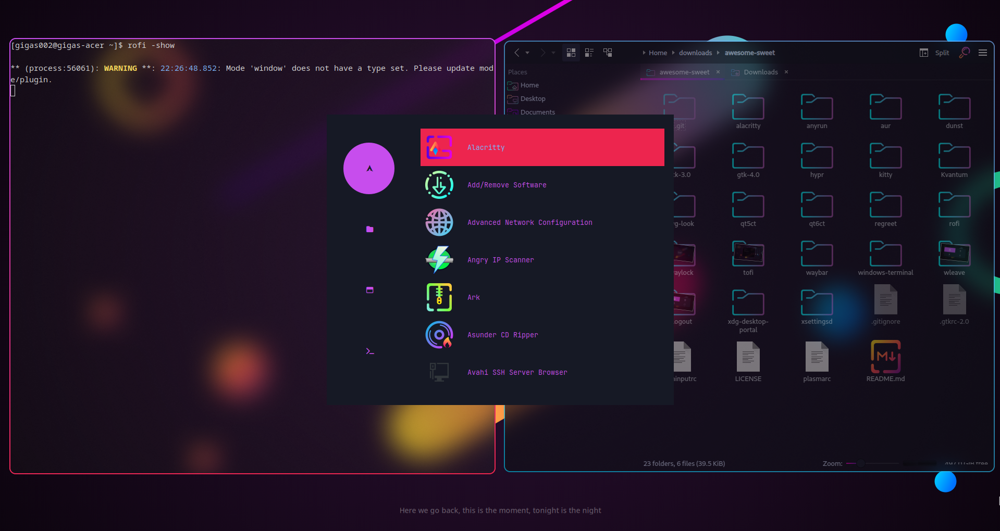

# Sweet-Rofi

Sweet theme for [rofi](https://github.com/davatorium/rofi)/[lbonn-rofi](https://github.com/lbonn/rofi)

## Requriments

- Sweet folder icons ([aur](https://aur.archlinux.org/packages/sweet-folders-icons-git))

## Installation

Copy theme file to rofi config location, e.g. `~/.config/rofi/themes/Sweet.rasi`

Then, import your theme in your rofi config file, e.g. `~/.config/rofi/config.rasi`, add line `@theme "themes/Sweet.rasi"` and use color values

Also you should add this line to your `rofi`'s configuration file: `icon-theme: "Sweet-Rainbow";` in order to use `Sweet` icons

## Showcase

Note: this example is based on [hyprdots](https://github.com/prasanthrangan/hyprdots)
