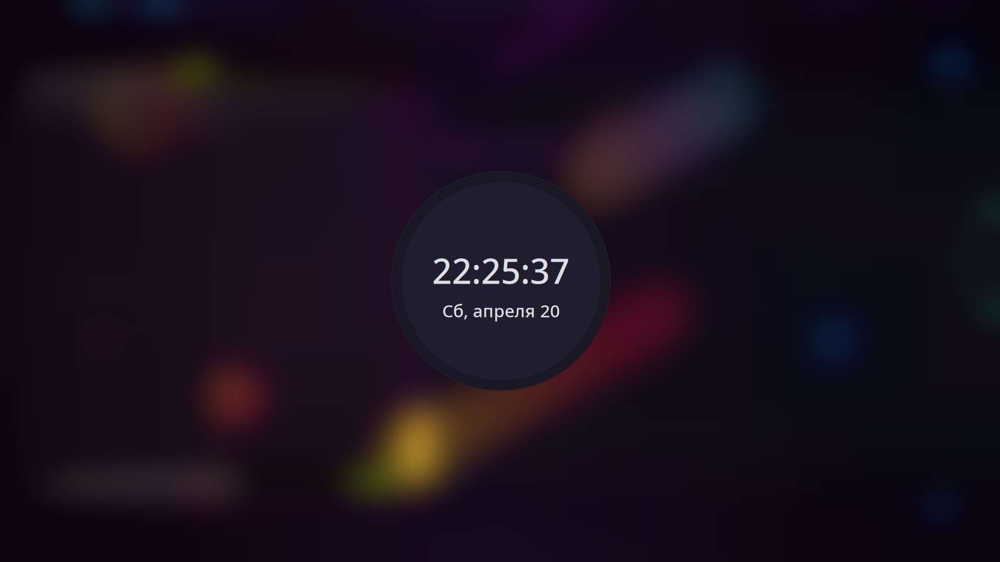

# Sweet-Swaylock

Sweet theme for [swaylock](https://github.com/swaywm/swaylock)

## Requriments

There's none, it's a color scheme

## Installation

I'm not aware if you can split and import theme/configuration files with `swaylock`, so for now instructions are following:

Copy or replace conflicting values from `Sweet` theme file into your `~/.config/swaylock/config`

## Showcase

Note: this example is based on [hyprdots](https://github.com/prasanthrangan/hyprdots)
