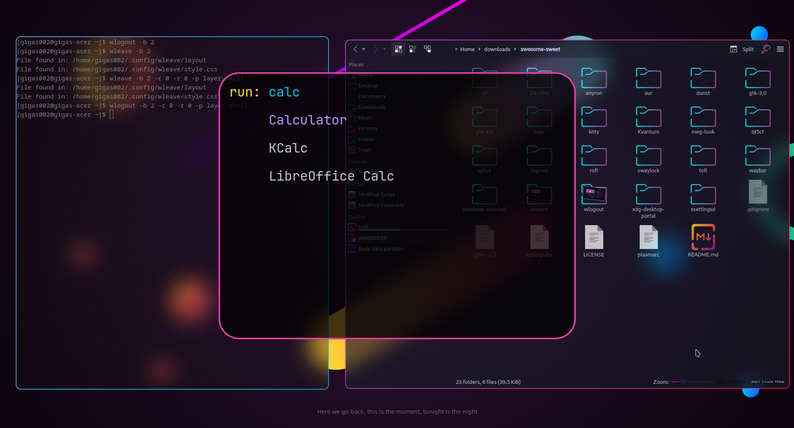

# Sweet-Tofi

Sweet theme for [tofi](https://github.com/philj56/tofi)

## Requriments

There's none, it's a color scheme

## Installation

Copy theme file to your desired location, e.g. `~/.config/tofi/themes/Sweet`

Then, import your theme in config file, e.g. `~/.config/tofi/config`, adding the line: `include = "themes/Sweet"`

## Showcase

