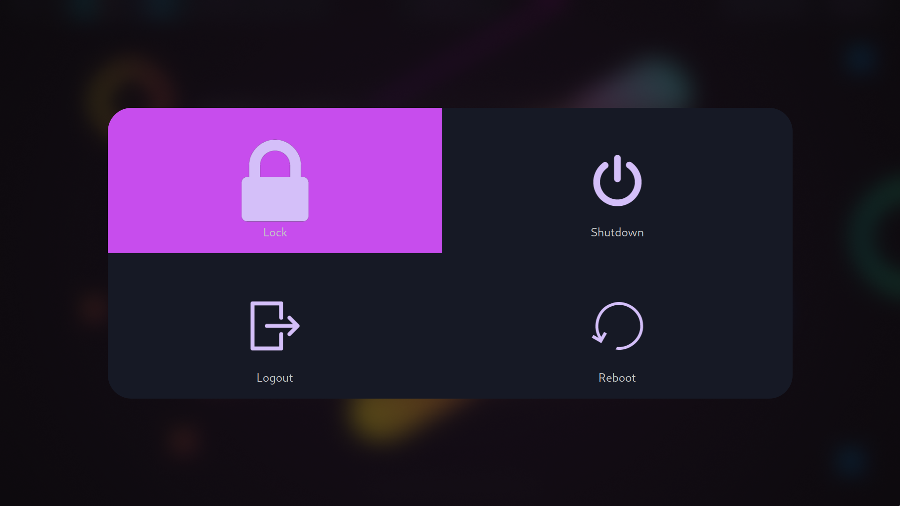

# Sweet-Wlogout

Sweet theme for [wlogout](https://github.com/ArtsyMacaw/wlogout)

## Requriments

There's none, it's a color scheme

## Installation

Copy theme file to your desired location, e.g. `~/.config/wlogout/themes/Sweet.css`

Then, import your theme in config file, e.g. `~/.config/walogout/style.css`, adding the line: `@import "Sweet.css";`

Now you can use your sweet colors in a theme!

## Showcase

Notes: this example runs as: `wlogout -b 2 -c 0 -r 0 -p layer-shell`
