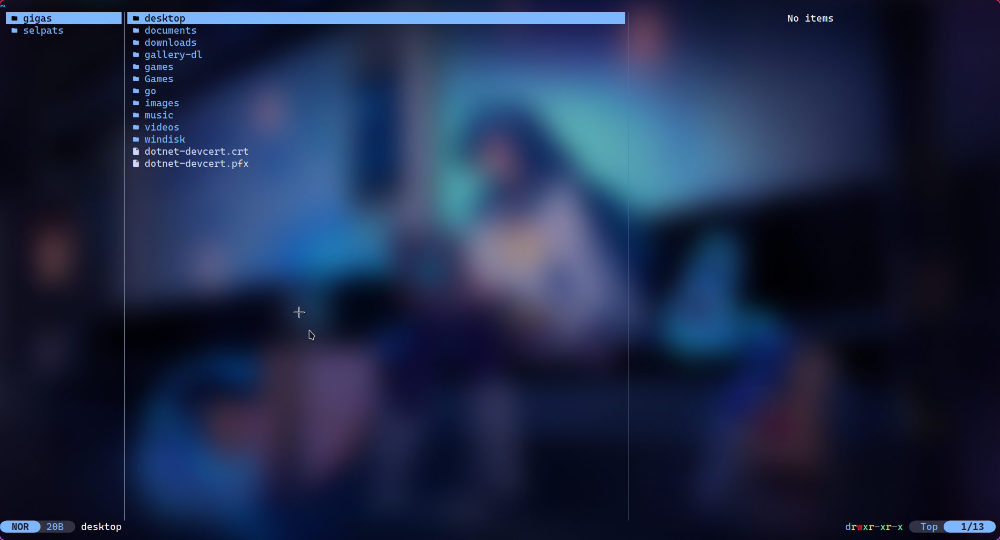

# Sweet-Yazi

Instruction on how to use `Sweet` theme with [yazi](https://github.com/sxyazi/yazi)

## Installation

Copy the `Sweet.toml` file into `~/.config/yazi/flavors/Sweet.yazi/flavor.toml`. Then, add the flavor into `~/.config/yazi/theme.toml`:

```toml
[flavor]
dark = "Sweet"
light = "Sweet"
```

## Showcase


