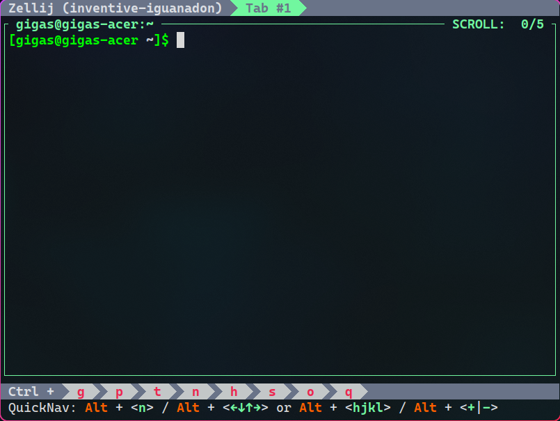

# Sweet-Zellij

Sweet theme for [zellij](https://github.com/zellij-org/zellij)

## Requriments

There's none, it's a color scheme

## Installation

Copy theme file into `~/.config/zellij/themes/Sweet.kdl`

Then, reference theme in `~/.config/zellij/config.kdl`: `theme "Sweet"`

You don't need to specify the full path, if the theme file is in above location, `zellij` will find it automatically

## Showcase

